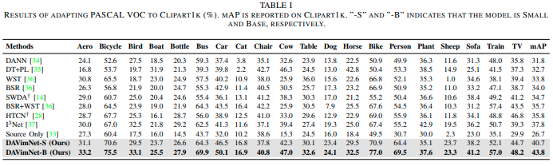
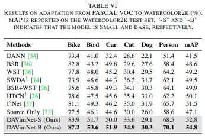

# DA-Mamba: Domain Adaptive Hybrid Mamba-Transformer Based One-Stage Object Detection (Old Name = DAViMNet: SSMs-Based Domain Adaptive Object Detection)

[A. Enes Doruk](www.linkedin.com/in/enesdrk), [Hasan F. Ates](https://www.ozyegin.edu.tr/en/faculty/hasanates-cs)

Deep-VIP Lab, Ozyegin University.

---

[arxiv](https://arxiv.org/abs/2502.11178)

[](https://arxiv.org/abs/2502.11178)
[](https://github.com/enesdoruk/DAVimNet)


This repository is the official PyTorch implementation of "SSMs-Based Domain Adaptive Object Detection"

---

Recent 2D CNN-based domain adaptation approaches struggle with long-range dependencies due to limited receptive fields, making it difficult to adapt to target domains with significant spatial distribution changes. While transformer-based domain adaptation methods better capture distant relationships through self-attention mechanisms that facilitate more effective cross-domain feature alignment, their quadratic computational complexity makes practical deployment challenging for object detection tasks across diverse domains. Inspired by the global modeling and linear computation complexity of the Mamba architecture, we present the first domain-adaptive Mamba-based one-stage object detection model, termed DA-Mamba. Specifically, we combine Mamba’s efficient state-space modeling with attention mechanisms to address domain-specific spatial and channel-wise variations. Our design leverages domain-adaptive spatial and channel-wise scanning within the Mamba block to extract highly transferable representations for efficient sequential processing, while cross-attention modules generate long-range, mixed-domain spatial features to enable robust soft alignment across domains. Besides, motivated by the observation that hybrid architectures introduce feature noise in domain adaptation tasks, we propose an entropy-based knowledge distillation framework with margin ReLU, which adaptively refines multi-level representations by suppressing irrelevant activations and aligning uncertainty across source and target domains. Finally, to prevent overfitting caused by the mixed-up features generated through cross-attention mechanisms, we propose entropy-driven gating attention with random perturbations that simultaneously refine target features and enhance model generalization. Extensive experiments demonstrate that DA-Mamba consistently outperforms existing methods across a range of widely recognized domain adaptation benchmarks.

<p align="center">
  
</p>

#### Contents

1. [Requirements and Installation](#Requirements-and-Installation)
1. [Datasets](#Datasets)
1. [Training](#Training)
1. [Results](#Results)
1. [Citation](#Citation)
1. [License and Acknowledgement](#License-and-Acknowledgement)


## Requirements and Installation
> - Python >= 3.9, PyTorch >= 2.0.1
> - CUDA >= 11.8

- Clone Repo and Install Dependencies
    ```bash
   git clone https://github.com/enesdoruk/DAVimNet.git
   cd DAVimNet
   conda env create --file=environment.yml
   ```


## Datasets

* **PASCAL_VOC 07+12**: Please follow the [instruction](https://github.com/rbgirshick/py-faster-rcnn#beyond-the-demo-installation-for-training-and-testing-models) to prepare VOC dataset.
* **Clipart/WaterColor**: Please follow the [instruction](https://github.com/naoto0804/cross-domain-detection/tree/master/datasets) to prepare dataset.
* **CitysScape, FoggyCityscape**: Download website [Cityscape](https://www.cityscapes-dataset.com/), see dataset preparation code in [DA-Faster RCNN](https://github.com/yuhuayc/da-faster-rcnn/tree/master/prepare_data)

## Training
** You should arange hyperparameters if you do not use on official hyperparamters which are mentioned in the paper
```bash
   bash scripts/train_davimnet.sh
   ```


## Results

<p align="center">
  
</p>

<p align="center">
  
</p>

## Citation
  ```
  @article{doruk2025davimnet,
  title={DAViMNet: SSMs-Based Domain Adaptive Object Detection},
  author={Doruk, A and Ates, Hasan F},
  journal={arXiv preprint arXiv:2502.11178},
  year={2025}
}
  ```

## License and Acknowledgement
This project is released under the CC-BY-NC license. We refer to codes from [SSD](https://github.com/amdegroot/ssd.pytorch) and [I3Net](https://github.com/czzbb/I3Net/tree/main). Thanks for their awesome works. The majority of DAVimNet is licensed under CC-BY-NC.
