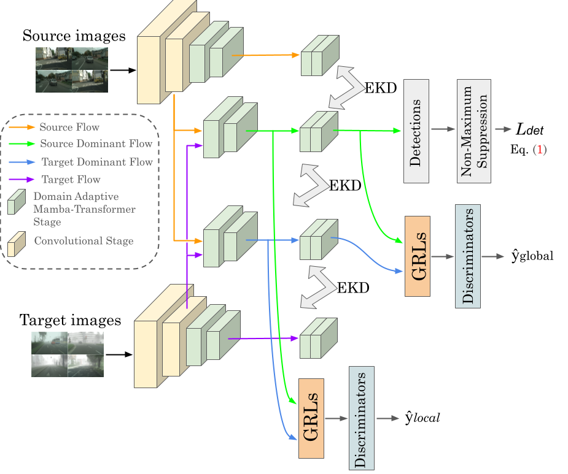

# DAViMNet: SSMs-Based Domain Adaptive Object Detection

[A. Enes Doruk](www.linkedin.com/in/enesdrk), [Hasan F. Ates](https://www.ozyegin.edu.tr/en/faculty/hasanates-cs)

Deep-VIP Lab, Ozyegin University.

---

[arxiv](https://arxiv.org/abs/2502.11178)

[](https://arxiv.org/abs/2502.11178)
[](https://github.com/enesdoruk/DAVimNet)


This repository is the official PyTorch implementation of "SSMs-Based Domain Adaptive Object Detection"

---

Unsupervised domain adaptation (UDA) for object detection adapts models trained on labeled source domains to unlabeled target domains, ensuring robust performance across domain shifts. Transformer-based architectures excel at capturing long-range dependencies but face efficiency challenges due to their quadratic attention complexity, which limits scalability in UDA tasks. To address these issues, we propose a hybrid domain-adaptive Mamba Transformer architecture that combines Mamba's efficient state-space modeling with attention mechanisms to tackle domain-specific spatial and channel-wise variations. Each hybrid block integrates domain-adaptive Mamba blocks and attention mechanisms: Domain-Adaptive Mamba employs spatial and channel state-space models to adaptively model domain variations, while attention mechanisms leverage self-attention for intra-domain feature enhancement and cross-attention for effective source-target alignment. Our approach processes both shallow and deeper features, employing an entropy-based knowledge distillation framework with margin ReLU to emphasize discriminative features and suppress noise. Gradient Reversal Layers enable adversarial alignment across network layers, while entropy-driven gating attention with random perturbations refines target features and mitigates overfitting. By unifying these components, our architecture achieves state-of-the-art performance in UDA object detection, balancing efficiency with robust generalization.

<p align="center">
  
</p>

## Results

<p align="center">
  
</p>

<p align="center">
  
</p>

<p align="center">
  
</p>

## Citation
  ```
  @article{doruk2025davimnet,
  title={DAViMNet: SSMs-Based Domain Adaptive Object Detection},
  author={Doruk, A and Ates, Hasan F},
  journal={arXiv preprint arXiv:2502.11178},
  year={2025}
}
  ```

## License and Acknowledgement
This project is released under the CC-BY-NC license. We refer to codes from [SSD](https://github.com/amdegroot/ssd.pytorch) and [I3Net](https://github.com/czzbb/I3Net/tree/main). Thanks for their awesome works. The majority of DAVimNet is licensed under CC-BY-NC.
